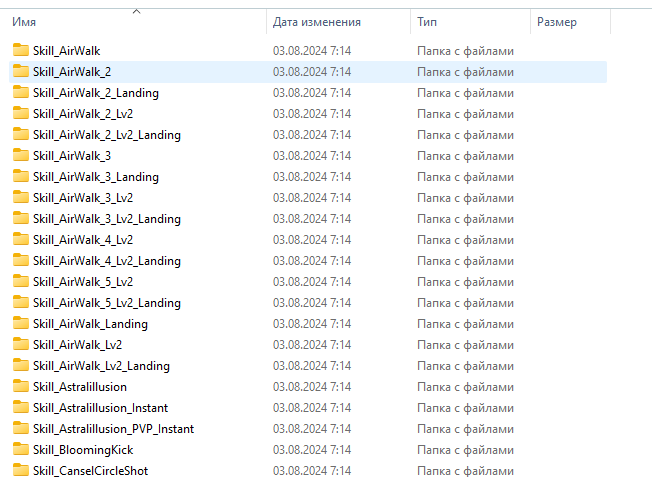
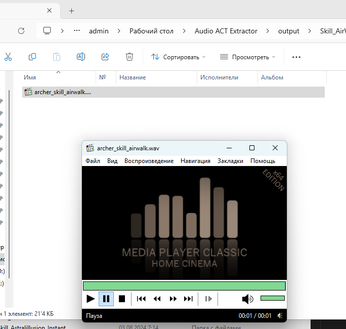

# 🎵 Dragon Nest Sound Tool Guide

### Author: Alice Morozova ([@alicestoneprod](https://github.com/alicestoneprod))

---

## How to Use:

1. 📁 **Open `config.json` file**

   - ⚠️ **Do not move** or **rename** this file.

2. 🗂️ **Provide the path to the `.ACT` file**

   - Recommended: **absolute path** in the `actFilePath` option.

3. 📂 **Set the path to `workdir`**

   - This should be the `gameres` folder.
   - Best option: absolute path to the `sound` folder.

4. 📁 **Set the output folder path**

   - It can be either **relative or absolute**, whichever you prefer.

5. ▶️ **Run `script.exe`**
   - Check the results of the script execution.

## 

## 

Happy Modding! 🎉
